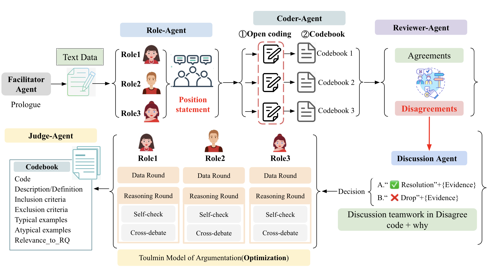

# PerspectiveCoder-LM: A LLM-based Multi-perspective-agent System for Large-scale Corpus Inductive Coding Analysis 
A command-line workflow for generating qualitative research codebooks with multi-agent large language model discussions. The entry point `main.py` orchestrates loading interview data, instantiating role-playing agents, and exporting baseline and discussion codebooks.

| [**Paper**]()|
<p align="center">
  <sub>System Introduction</sub>  
</p> 

<p align="center">
  <a href="https://latitude.so/developers?utm_source=github&utm_medium=readme&utm_campaign=prompt_repo_sponsorship" target="_blank">
    
  </a>
</p>

## Contents

- [Introduction](#Introduction)
- [Install](#install)
# Introduction
### Project 
[Management-Google Doc](https://docs.google.com/document/d/1yQeDEgtlWTl9SLAgr3bBJ9_l59sWQwWXsGzLFwkRVKY/edit?tab=t.utp4mklu2c15)

### results link
Study 1: [results](https://drive.google.com/drive/folders/1d6FLKN7mHcevlgLD-NaRlsu3wcjnqQ59)


## Features
- Multi-agent discussion pipeline (`experiment_discuss_flow`) that coordinates three coding agents plus reviewer, discussion lead, and judge roles.
- Single-agent baseline pipeline (`experiment_single_flow`) for comparison studies.
- Automatic creation of experiment output folders and JSON exports.
- Configurable through JSON configuration files and CLI arguments.

## Project Layout
```
PerspectiveCoder-LM/
├── main.py                 # CLI entry point (discuss & baseline flows)
├── config/                 # Model and discussion configuration JSON files
├── Data/                   # Source interviews and processed datasets
├── utils/                  # Core agent orchestration utilities
└── ...
```
## Install
### Requirements
- Python 3.10+
- Dependencies listed in `requirements.txt`
- Access to the target language models configured in `config/config.json`

```powershell
pip install -r requirements.txt
```

### Command-Line Usage
`main.py` exposes a single CLI with several switches:

```powershell
python main.py `
  --input-file F:\Work\Debate\PrivousPerspectiveCoder-LM\Data\Scrum-interviews\processed\Scrum.json `
  --output-dir F:\Work\Debate\PrivousPerspectiveCoder-LM\Data\Scrum-interviews\gpt-4o_output `
  --config-dir F:\Work\Debate\PrivousPerspectiveCoder-LM\config\config.json `
  --model-name gpt-4o `
  --research-question "1. How do Scrum practitioners define software quality?" `
  --experiment-name 0
```

### CLI Arguments
| Flag | Default | Description |
| --- | --- | --- |
| `-i`, `--input-file` | `Data/Scrum-interviews/processed/Scrum.json` | JSON dataset containing interview records. Each record may include a `code` field which is removed before processing. |
| `-o`, `--output-dir` | `Data/Scrum-interviews/gpt-4o_output` | Root directory where experiment results are stored. Subfolders are created automatically if missing. |
| `-c`, `--config-dir` | `config/config.json` | Discussion configuration consumed by `DiscussFlowModel`. |
| `-m`, `--model-name` | `gpt-4o` | Target LLM name. Accepts a single model or a list mapped to individual roles. |
| `-rq`, `--research-question` | `""` | Research question context injected into agent prompts. |
| `-exp`, `--experiment-name` | `0` | Experiment selector: `0` discuss flow, `1` single-agent baseline, `2` discuss flow with matched identities. |

### Experiment Outputs
Depending on the experiment, the script writes JSON summaries under the chosen `output_dir`:
- `discuss_process/json/discuss.json`: team discussion results with agreed and final codebooks plus token usage statistics.
- `baseline1/json/baseline1.json`: single-agent codebook for the baseline condition.

Experiment `0` and `2` require six roles (`Role1`, `Role2`, `Role3`, `Reviewer`, `Discussion`, `Judge`). Role identities are generated via `roles_identity_generate`, enriched with positionality and initial codebooks, and evaluated by the reviewer/discussion/judge trio. Experiment `1` runs only `Role1` through the baseline pipeline.

### Customisation Tips
- **Datasets**: Place new interview corpora under `Data/` and point `--input-file` at the desired JSON file.
- **Configurations**: Update `config/discuss_config*.json` or `config/config.json` to tweak model endpoints, prompt templates, and stage settings.
- **Role Assignments**: Pass a list to `--model-name` to mix different models across roles (e.g., `"gpt-4o,gpt-4o-mini,gpt-5"`).
- **Research Question**: Supply a domain-specific question with `--research-question` to adjust agent framing.

### Reproducing Default Run
1. Ensure the default dataset `Scrum.json` exists at the processed path.
2. Activate your environment and install dependencies.
3. Execute the command shown in *Command-Line Usage* with `--experiment-name 0`.
4. Inspect `Data/Scrum-interviews/gpt-4o_output/discuss_process/json/discuss.json` for the full discussion artifact.

### Troubleshooting
- Missing output folders: `main.py` creates the baseline and discussion directories when `--output-dir` does not exist, but upstream directories must already be present.
- Invalid model mapping: ensure the number of models in a list equals the number of coding roles (excluding reviewer/discussion/judge).
- JSON parsing errors: verify the dataset and configuration files contain valid UTF-8 encoded JSON.

## License
The repository inherits its license terms from `PerspectiveCoder-LM`. Add explicit licensing information here if required.
